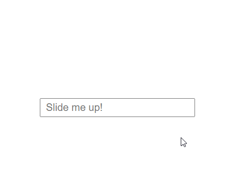

# slideable-input-number
⁉ A simple class that allow users to change the value of a numeric input by clicking on it and sliding up and down.

# Purpose

I’m really not sure. But if you need that, here it is.



# Install

```bash
$ npm install --save slideable-input-number
```

Or just copy the `index.js` file and include it in your project as you wish.

# Usage

Just call the class with a selector related to your input. It can either be a string or a DOM element.

```html
<input class="my-input" type="number" min="0" max="500">
```

```javascript
// For ES6 import-style
import SlideNumber from 'slideable-input-number'

new SlideNumber('.my-input')
// OR
new SlideNumber(document.querySelector('.my-input'))
```

## Options

You can have a few options to use:

* `resetCount` → If set to true, each time you will click in the input it will start back to 0 instead of just continue with the current value
* `minValue` → You can define a minimal value here. You can either use the `min=""` attribute on your html field, or the option in the class instance. Note that if you define both, the js parameter will prevail.
* `maxValue` → Same, but for a maximal value

```javascript
new SlideNumber('.my-input', {
	resetCount: true,
	minValue: 0,
	maxValue: 500
})
```

## Todo

* Add the ability to use `steps=""` attribute
